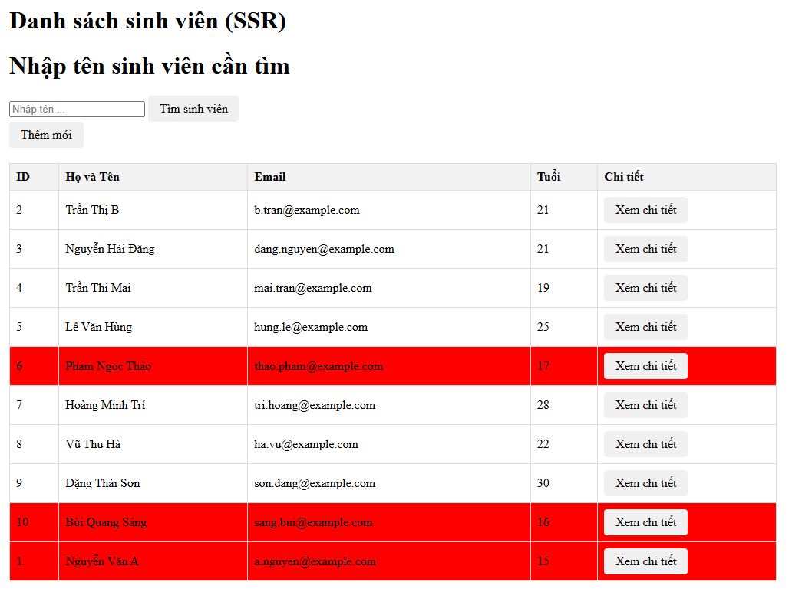
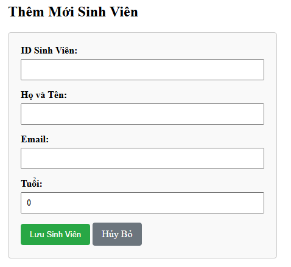
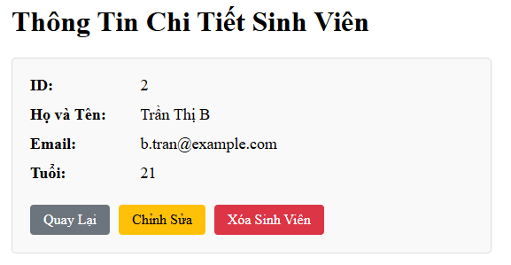
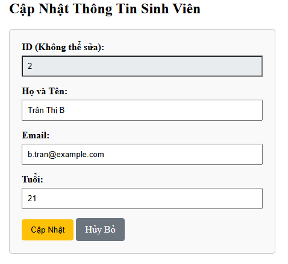
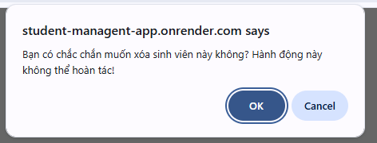

# Hệ Thống Quản Lý Sinh Viên (Student Management System)
***Lab môn học Công nghệ phần mềm nâng cao - CO3065 - HK252***  


## 1. Danh sách thành viên nhóm
| STT | Họ và Tên | MSSV |
| :---: | :--- | :---: |
| 1 | Trần Trọng Nghĩa | 2312285 |

## 2. Public URL (Deploy Web Service - Lab5)
Dự án đã được triển khai thành công lên nền tảng Render kết hợp cơ sở dữ liệu Neon PostgreSQL.

**[Truy cập ứng dụng trực tiếp tại đây](https://student-managent-app.onrender.com/)**

*(Lưu ý: Vì sử dụng gói miễn phí của Render, ứng dụng có thể mất 30-50 giây để "khởi động" cho lần truy cập đầu tiên. Xin vui lòng đợi một chút!)*

## 3. Hướng dẫn cài đặt và chạy dự án (Local Development)

### Yêu cầu môi trường:
* **Java:** JDK 21 hoặc 23.
* **Maven:** 3.8+
* **Database:** PostgreSQL (hoặc Docker để chạy container PostgreSQL).
### Bước 1: Clone mã nguồn
```bash
git clone https://github.com/NewtakaNghia/Advanced-Software-Lab.git
cd Advanced-Software-Lab
```

### Bước 2: Cấu hình biến môi trường
Tạo một file .env ở thư mục gốc của dự án (ngang hàng pom.xml) và điền thông tin Database của bạn:
```bash
SPRING_DATASOURCE_URL=jdbc:postgresql://localhost:5432/student_db
SPRING_DATASOURCE_USERNAME=postgres
SPRING_DATASOURCE_PASSWORD=mat_khau_cua_ban
```

### Bước 3: Khởi chạy ứng dụng:
*Bảo đảm cơ sở dữ liệu postgresql đã được tạo từ trước do maven không hỗ trợ tạo mới cơ sở dữ liệu*
Nếu có thay đổi bất kỳ thư viện trong pom.xml thì chạy
```bash
mvnw dependency:resolve
```
#### Cách 1: Chạy trực tiếp bằng Maven
```bash
export SPRING_DATASOURCE_URL=jdbc:postgresql://localhost:5432/student_db
export SPRING_DATASOURCE_USERNAME=postgres
export SPRING_DATASOURCE_PASSWORD=mat_khau_cua_ban
mvnw spring-boot:run
```

#### Cách 2: Chạy bằng Docker (Nếu có)
Nếu máy bạn đã cài Docker, chỉ cần chạy lệnh sau để build và khởi động:
```bash
docker build -t student-app .
docker run -p 8080:8080 --env-file .env student-app
```
Sau khi ứng dụng chạy thành công, truy cập trình duyệt tại:**[localhost](http://localhost:8080/students)**

## 4. Trả lời câu hỏi Lab:
**Câu 1:** *Ràng buộc khóa chính (Primary Key) Quan sát thông báo lỗi: UNIQUE constraint failed. Tại sao Database lại chặn thao tác này?*  
*Trả lời:* Khóa chính sinh ra để đảm bảo **Tính toàn vẹn thực thể**. Mỗi một dòng dữ liệu trong bảng phải là duy nhất và có thể được nhận diện tách biệt hoàn toàn với các dòng khác. Việc khai báo trường ID là khóa chính và nhập cùng lúc hai sinh viên cùng một ID sẽ gây vi phạm tính toàn vẹn trên nên Database báo lỗi và chặn hành động thêm mới dữ liệu này.  
**Câu 2:** *Toàn vẹn dữ liệu (Constraints) - Bỏ trống cột name (NULL) và hệ lụy ở tầng code Java*  
*Trả lời:* Không. Nếu trong class `Student` và bảng `student` ở Database không có ràng buộc `NOT NULL` thì việc thêm vào một sinh viên không có trường tên sẽ được đưa vào Database trót lọt. Trước tiên thì việc thêm vào sẽ không gây ra lỗi quá nghiêm trọng, nhưng khi thao tác ở tầng Frontend, nếu ta gọi các hàm thao tác với biến name đó thì ứng dụng Java sẽ ngay lập tức bị sập và bắn lỗi. Do đó, chúng ta luôn phải kiểm tra và tạo rào chắn 2 đầu: Rảng buộc `NOT NULL` ở Database và Validate dữ liệu ở tầng Service trước khi nhập xuống Database.  
**Câu 3:** *Cấu hình Hibernate: Tại sao mỗi lần tắt ứng dụng và chạy lại, dữ liệu cũ trong Database lại bị mất hết?*  
*Trả lời:* Có thể do cấu hình thuộc tính spring.jpa.hibernate.ddl-auto trong file `application.properties` đang bị đặt sai. Nếu cấu hình là `create`: Mỗi khi `Spring Boot` khởi động, `Hibernate` sẽ gửi lệnh để xóa sạch bảng cũ cùng dữ liệu, sau đó tạo bảng mới không có dữ liệu. Do đó, để tránh việc mất dữ liệu mỗi khi khởi động lại ứng dụng thì nên cấu hình là `update`.

## 5. Screenshot các Module đã thực hiện trong Lab 4.
### 5.1 Chức năng hiển thị danh sách và Tìm kiếm (Read & Search)


### 5.2 Chức năng Thêm mới sinh viên (Create)


### 5.3 Chức năng Chỉnh sửa và Xem chi tiết (Update & View)



### 5.4 Chức năng Xóa với Confirm Dialog(Delete)

